# <u>Milestone Project 3: Aesops Fables</u>

 

# Click link to visit ["Aesops Fables"](https://aesops-fables-ms3.herokuapp.com/)

# Contents

## - [Project Aims](#aim-of-the-project)
## - [User Story](#user-story)
## - [The 5 planes of UX](#the-5-planes-of-ux)
## - [Early Stages](#early-stages)
## - [The Website Features](#the-website-features)
## - [User Interaction](#user-interaction)
## - [The Coding Languages and Techniques Used](#the-coding-languages-and-techniques-used)
## - [Method of Deployment](#method-of-deployment)
## - [Methods of Testing](#methods-of-testing)
## - [Code Validations](#code-validations)
## - [Credits](#credits)

 

# Aim of the project

- The first aim of this project is to create an interesting website, reflecting on the fables written by greek storyteller Aesop. Myself, coming from a non religious background and being raised in a multi-denominational school with no religious education, the fables were a way to teach children the morals adhered to in life from a completely fictional and light-hearted perspective. For some, Aesops Fables will be completely new to them, for others it will be a chance to reflect on the stories read and taught to them throughout their childhood.

- The second aim of the project is to encourage the user to register so as to gain access to more of the sites content. Content should be varied enough to make the user feel it's  a worthwhile exercise registering.

- The third aim of the project is to encourage the creativity of the registered user visiting the site to write their own fable. In theory, each new story would be read and considered for featuring within our selection of fables. Since this is a mock-up website the purpose of this aspect is purely to demonstrate the ability to submit a story / fable and as such, obviously the tale would not be featuring in the fable selection. 

# This site should appeal to and be suited for : 

- Someone who grew up learning using Aesop Fables.
- Someone who has recently learnt and has an interest in the Fables. 
- Someone who has an interest in Greece, it's history, and is looking to expand on their knowledge of Aesop.
- Someone who has an interest in writing short stories.
- An educational body (schools, writing organisations etc) who use or have an interest in including Aesops fables into the current learning curriculum. 
 

# User Story

- As a first time visitor to the site, I would want a clean, clear user interface, instantly outlining the purpose of the site. 
- As a first time visitor I would want to be able to navigate easily to the relevant areas of the site that are of interest to me.
- As a first time visitor I would want to know the benefits of creating an account and why it is being suggested to log in.
- As a visitor to the site I would expect responsiveness across all devices so the content would look and feel the same regardless of the device used.
 

- As a returning visitor to the site I would want to log in to my account to access my personal details and any interactivity I have taken part in.
- As a returning visitor I would want to access my profile to access, edit and delete any stories I have submitted.

- User Conclusion
    - After visiting the site I would like to feel that I have enjoyed a good user experience interacting with the site.
    - I have learnt something regarding the storyteller Aesop and the fables that made him famous.
    - I have contributed to the whole experience by submitting content that could potentially be included within the site.
    - I would have gained enthusiasm and motivation to encourage educational bodies to visit the site, and encourage young learners to read the stories, and create their own.

# The 5 planes of UX

- When planning out this site I thought it important to implement the same 5 planes of UX that I had used when designing my Milestone Project 1 and 2. Doing this makes the process an easier task.

## <u>The strategy</u>

- In planning out this website I specifically wanted to target users who fell into these brackets:
    - Those who are familiar with the fables of Aesop and wanted to revisit the stories for themselves.
    - Those who are familiar with the fables of Aesop and wanted to share them with friends, family etc.
    - Those working within an educational body wanting to share the fables as part of their curriculum.
    - Those who would use the site as an informative and interactive platform for children to learn the fables through reading the history aspects, test their knowledge, and be encouraged to become creative in writing their own tales.
    - Those who have stumbled across Aesop and want to learn more.
    - Those with an interest in Ancient Greece and wish to view relevant information.

- As a developer I would want a site that was easily maintainable and easy to update with new content as the site progressed.

    
## <u>The Scope</u>

- Based on the strategy above I began to work on the scope of the site taking into consideration the following factors:
    - The user should be able to:
        - Navigate easily around the entire site in a clear and effective manner.
        - Have the navigation areas clearly marked with full text on larger screens and the standard familiar collapsible navigational button on smaller screens.
        - Find the site attractive with text elements easy to read and images to be clear, and interesting in appearance.
        - Feel interested enough to want to register with the site to gain the extra, exclusive content.
        - Register with minimal fuss and only have to supply the absolute necessary information to create an account. 
        - Once registered, be content that the process was worthwhile and the additional content is varied and not just more text based information.
        - Find aspects of the site appealing enough that they would want to return.
        - Become interested enough that they themselves would want to return to the site to submit stories that they've written and submitted to be displayed in a future feature.
        - Introduce the site within educational departments encouraging children to interact with the site, watching stories and submitting their own.

## <u>The Structure</u>

- I planned on using set elements throughout the project so as to keep the sense of familiarity running regardless of the content on the page. Therefore I incorporated:
    - A fixed Navbar, present on all screens, displaying the relevant options to the user at their point of the journey,

    - 
    - 
---

- A floating footer bar featuring a link to the original Aesops fables page on Wikipedia and on a personal level links to my Github repositories and LinkedIn pages along with my name.

    - 
---

- The opening page will welcome the user to the site, explain the sites purpose and encourage the user to login to access more content. The user should notice the option to log in has been highlighted in the body of welcoming text but failing that the option to log in is also displayed within the Nav bar.

    - 
    - 

- If the user chooses not to log in then the options are limited and the user will only have access to the history page outlining certain aspects of Aesops life and stories. 
- If the user chooses to log in to the site they will be redirected to a log in page. If the user has never visited the site before then they will be required to register with the site. This is suggested at the bottom of the log in page.

    

- For the registration aspect I will have created a collection in a database within MongoDB where the information regarding the users name, email, and password will be safely stored. The password will be encrypted using the Werkzeug security password hash method.
- After registering, the user will be directed to a new screen with the new content made available to them.
    - 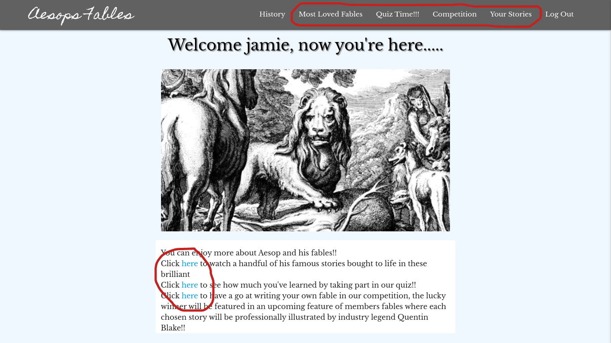

---

- For the competition aspect I will have created a collection in a database within MongoDB where the content of the users stories will be stored. This information will include the title and the story itself. The information will be connected to the registered user.
- From here the user can access the exclusive content including a quiz and a selection of Aesop Fables cartoons. The user will also have the option to submit a story of their own to be considered in a 'future feature' on the site. 
- If the user clicks on the 'Your Stories' tab before submitting a story then they will be greeted with the information that they haven't submitted any stories at this stage and to select the competition tab to do so.
    - 

- If the user wishes to submit a story then after clicking on the competition tab, they will be greeted with a brief explanation of the purpose of the page, and a brief explanation of the overall 'prize' offered if the story is deemed good enough to feature in a 'future feature'.
- Below this is the input fields where the user can write or paste in the story's title and the body of the story.
    - 

- Once a story has been submitted the content of the 'Your Stories' page now changes to reflect the new content.
    - 

- I have opted to use Materializes' collapsible element for displaying the user stories. Reason for this is that if the user chooses to submit more than story, the page will become extremely long, bulky and tedious to scroll through for the user. This way only the title will be displayed and if the user wishes to view the story then they can do so by simply expanding the title to reveal the title.

- Along with the title of the story I will have included an 'Edit' button and a 'Delete' button.
- Upon selecting the edit button the user will be redirected to an edit page wherein the user can make changes to the title and/or the story and save those changes to his/her profile 
    - 
    - 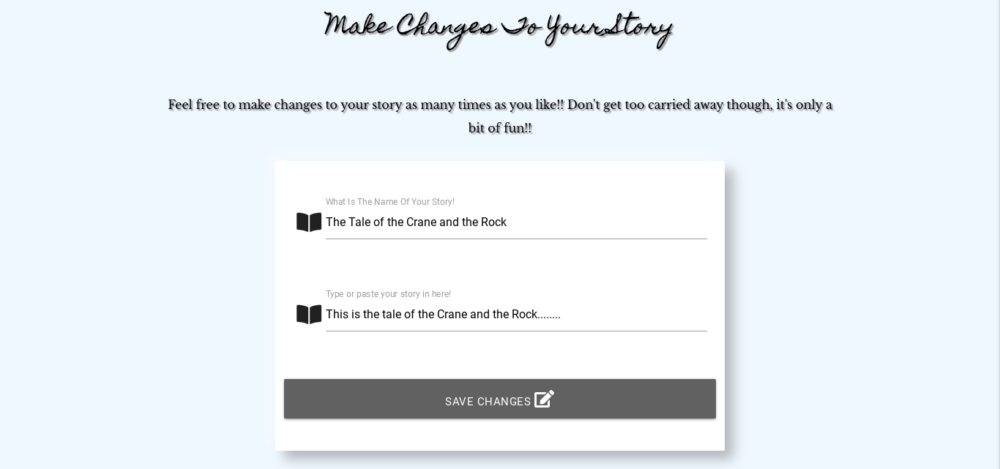

- Should the user decide that they no longer wish to keep that story then they can select the delete button.
- Once the delete button has been selected a modal will appear asking if the user is sure they wish to delete the story. Here the user will have the option to either cancel the deletion or select the delete button again removing the story from the database collection.
    - 
    - 
- If the user selects the 'No!!!' button then they will be redirected back to the main 'Your Stories' page.
---
- The 'Quiz Time' page will feature 5 cards, each with a question and multiple answers. 
- After thinking on the answer to the question the user will select the 'Click to reveal' portion of the card, revealing the correct answer to the question.
    - 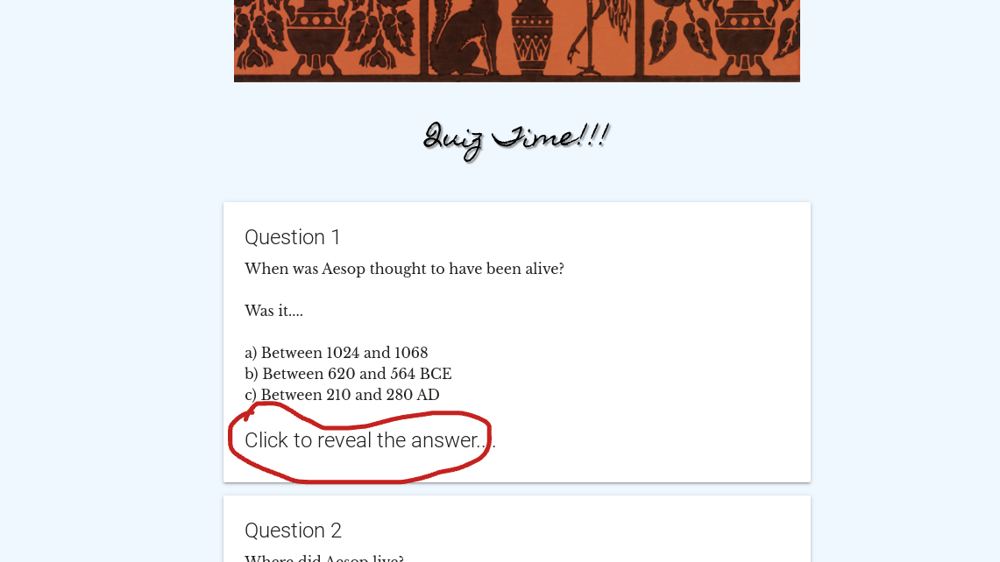

- If the user chooses to, he/she can return the card back to the question for someone else to have a guess simply by clicking on the closing X on the top right of the card.
    - 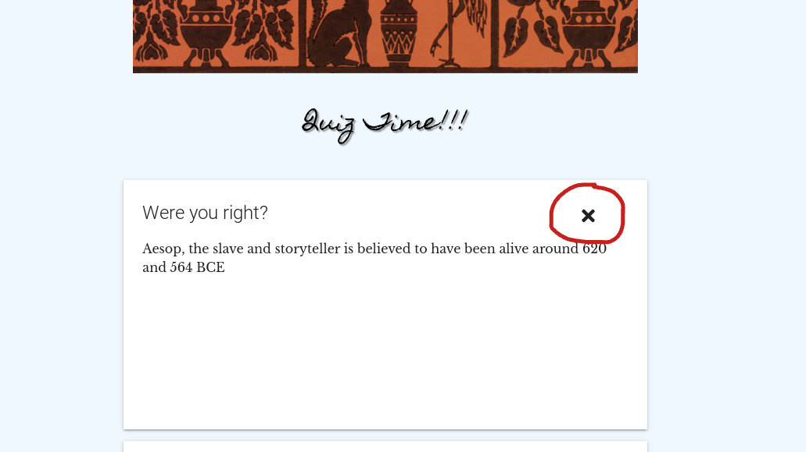

---
- The 'Most Loved Fables' page will feature 5 stories portrayed in cartoon format using embedded code from Youtube. The only interaction with these elements are to simply select to play the videos.

    - 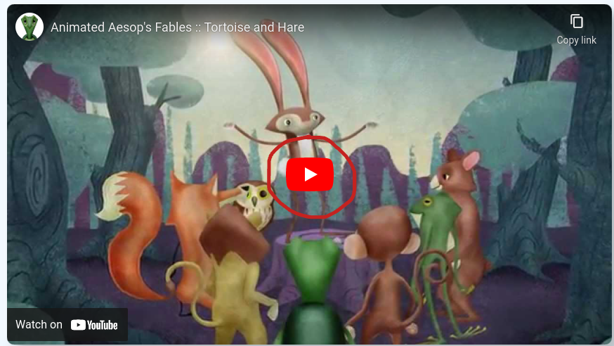

---

- The History page will not feature/require any user interaction. Textual information on the page will be subject to the size of the device the user is using to access the site.

---

- To add to the navigational aspect, I have included a 'back to the top' link on the Home, History, Most loved fables, and the Quiz time pages which is located at the bottom of each long scroll page.

    - 

---

    
- ## <u>From the Skeleton to the Surface</u>

- The idea of the bare bones of the project were sketched out in wireframes using Balsamiq. Laid out below is the realization of each wireframe into its actual state.

Home Page

History Page

Log In Page

Registration Page

    
    

- ## <u>The Surface</u>
    
   
    ---
# Early Stages

## Wireframes

- A summary of the home page on desktop, tablet, and mobile view.

- A summary of the history page on desktop, tablet, and mobile view.

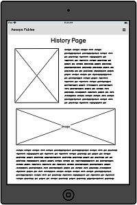

- A summary of the Log In page on desktop, tablet, and mobile view.

- A summary of the Logged In / Registered page on desktop, tablet, and mobile view.

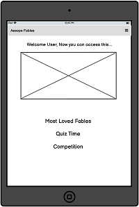
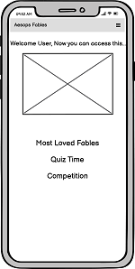

- A summary of the Registration page on desktop, tablet, and mobile view.

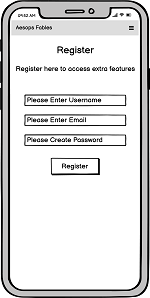

- A summary of the User Profile page on desktop, tablet, and mobile view.

- A summary of the Most Loved Fables page on desktop, tablet, and mobile view.

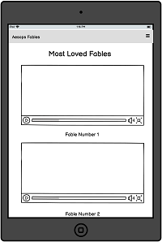
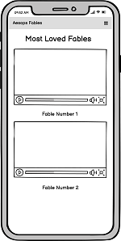

- A summary of the Quiz Time page on desktop, tablet, and mobile view.

- A summary of the Competition page on desktop, tablet, and mobile view.

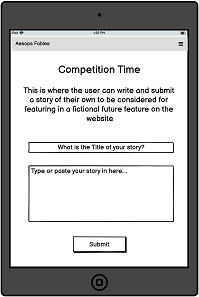

- A summary of the User Profile Story Edit page on desktop, tablet, and mobile view.

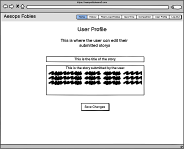

- A summary of the User Profile Story Delete page on desktop, tablet, and mobile view.

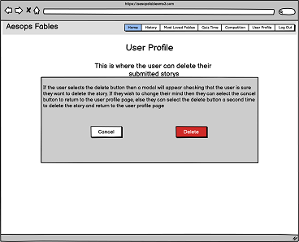
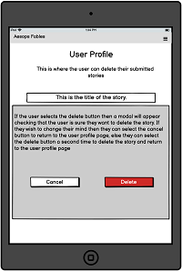

---

## Colour Schemes

EXPLANATION OF USE OF COLORSCHEME 

 

- I adopted these colors in the following styles:
    EXPAND ON THIS

## Fonts

- For the textual elements I imported in two font family variants from Google Fonts.

     
    - 
    - 

## Audio IF USED

# The Website Features

- ## <u>As Submitted</u>
       
- ## <u>Features I would include in the future</u>

# User Interaction

# The Coding Languages and Techniques Used

- This site was constructed using:
    - HTML5
    - CSS3
    - Javascript
    - jQuery
    - Materialize
    - Jinja
    - Fontawesome
    - Balsmiq was used for creating the wireframes for this project.
   
   # Method of Deployment

- To fully test the site on multiple 'real-world' devices I needed to create a live link to the site that could be accessed universally. To do this, a simple procedure is required. 

    - Step 1: Open Github.com and sign in.
    - Step 2: Once signed in you should see your repositorys in chronological order.
    - Step 3: Select the repository you wish to create a link for and once selected click the settings tab on the page.
    - Step 4: Within the settings page you will be given the option to rename the repository, add an image to customize your social media preview, and many other options to be explored at a later date.
    - Step 5: Scroll down and you will find the heading for GitHub Pages.
    - Step 6: At this stage the 'source' field should read 'none' so click on the button and select 'master'
    - Step 7: Once this is selected, hit save and the page should refresh bringing you back to the top.
    - Step 8: Scroll back down to the Github pages section and you will now see a message informing the user that the site is ready to be published and a highlighted link. Make a note of the link address for future reference or click the link to access the site direct. 

- From this point on you can type in and access your site on any device with an internet browser which is ideal for testing purposes.

## For those wishing to develop the site further using a repository clone:
- You must first ensure that you have a current Github account.
- Be running the most up to date version of Google Chrome with the Gitpod browser extension installed.
- Login to Github with your own github account.
- Navigate to the Project Github Repository page.
- Click the New button, this will trigger a new workspace.
- Under Create a new Repository select Import a Repository
- Now, in the Your Old Repository Clone URL field, type in ""
- Enter in a new relevant repository name and click Begin Import.
- After a short while you'll recieve a message saying that the new repository is ready with a link to take you to it.
- From here on, open gipod and continue future developments.  

# Methods of Testing

- Throughout the development stage I used a handful of methods to ensure the site looked and acted appropriately.  These included:

    - Chrome Dev Tools - for testing stylings, sizing, and responsiveness

    - Mozilla Dev Tools - for testing stylings, sizing, and responsiveness

    - http://ami.responsivedesign.is/ - again for testing stylings, sizing, and responsiveness.

    - https://coolors.co/ - for picking color schemes and testing contrast colors

    - Github Pages - to access the live site across different devices

    - Google Lighthouse - to test perfomance 

## Summary of User Testing

- User 1: 
 

- 

- User 2:
 

- User 3: 
 

- CONCLUSIONS

## Problems and bugs experienced along the way

- Problem: Image not displaying on homepage
- Fix: I created the images folder inside of the assets folder which wasn't being recognised in the url_for string so I tried creating the folder and contents inside the static folder and that solved the problem.
- Problem: iframe element spilling out of grid container.
- Fix: To fix this I researched and referenced the website "https://tylerduprey-52451.medium.com/a-perfect-video-container-with-css-37fd454c5eb5 on how to create the perfect video container. Following on from that I then styled the element to suit.
- Problem: When creating the Your Stories page all records from the collection are being displayed rather than just the signed in user.
- Fix:  Fixed session variables on logging into profile.
- Problem: Could not display other values to the Your Stories page using Jinja.
- Fix: Discovered that previously I had made an amendment to the username field direct in MongoDB so the field that the code was looking for no longer existed. After rolling back to the original entry the values display to the page.
- Problem: Could not display flash message on Your Stories page informing user that they had not submitted a story yet.
- Fix: Discovered that I wasn't checking if the collection existed in the correct method so adopted the count() method to determine if the corresponding collection existed, if it did exist then go ahead and display the story, if it doesn't then display the flash message with the relevant message. 
- Problem: Discovered that when deleting a story from the Your Stories page, the wrong story is being deleted.
- Fix: I realized that I hadn't targeted any related values to the modal button so to fix this I added a jinja reference to the selected _id within the modal buttons data target and the modals id field.

# Code Validations

## HTML Validator

- 

## CSS Validator

- 

## Javascript Validator

- 

## Lighthouse Testing

# Credits

- For information on Aesop and his fables: https://en.wikipedia.org/wiki/Aesop%27s_Fables

- To contain the video element: https://tylerduprey-52451.medium.com/a-perfect-video-container-with-css-37fd454c5eb5

- Image used on quiz page collected from: https://kidsreadnow.org/lessons-from-reading-fables/

- For help fixing a problem regarding the iframe elements I referenced: "https://tylerduprey-52451.medium.com/a-perfect-video-container-with-css-37fd454c5eb5

## Throughout the creation of this project I have referred to the following for assistance and guidance:

- https://codeinstitute.net/

# Acknowledgement

# - [Back to top](#contents)

